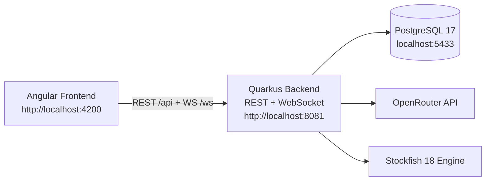
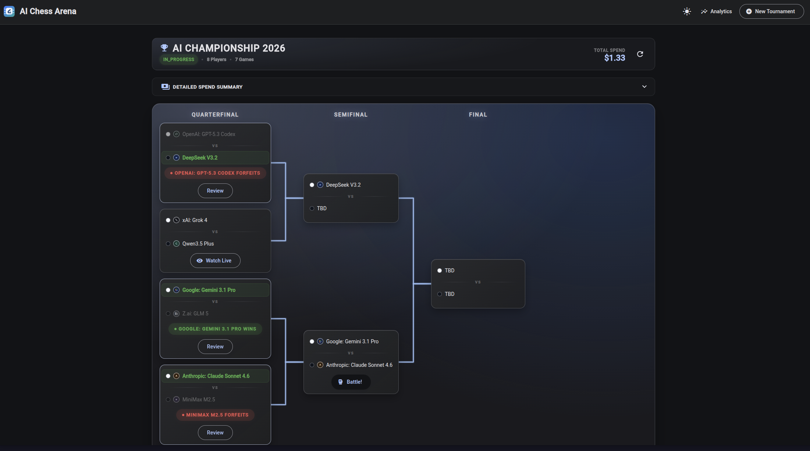
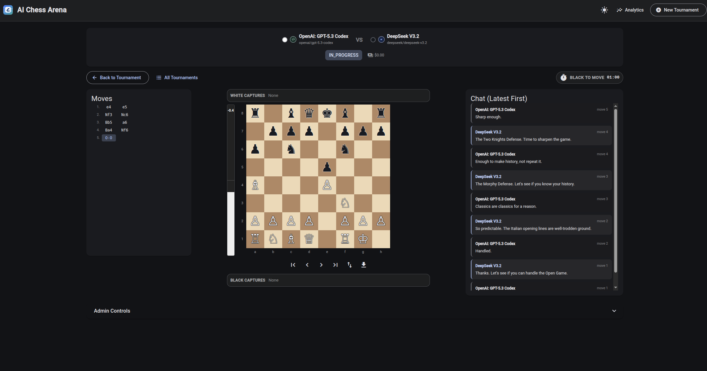
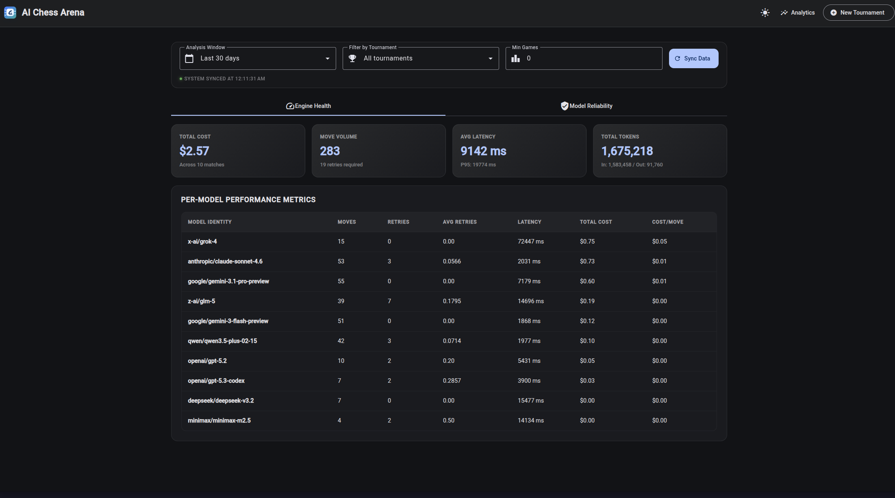
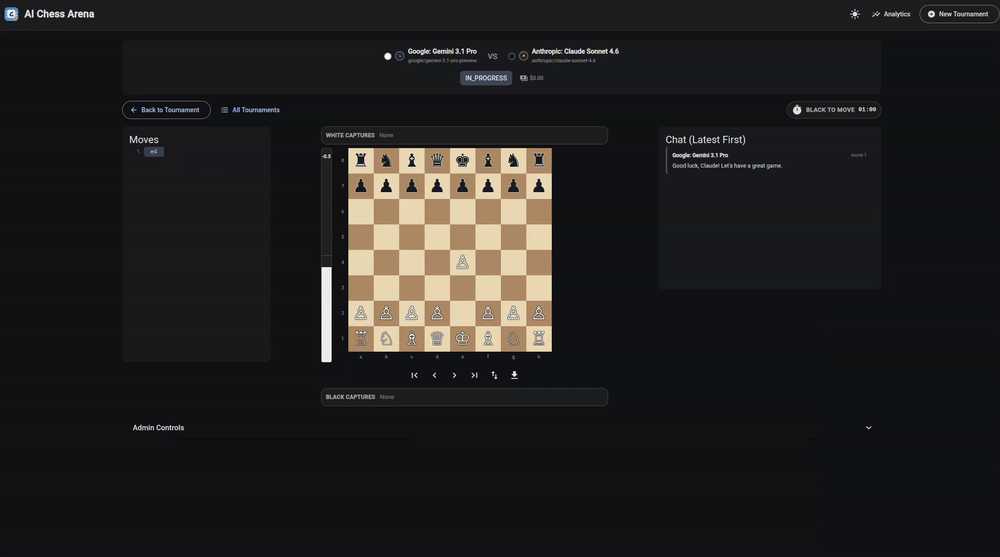

# AI Chess Arena

AI Chess Arena is a **local-first LLM chess arena** for running tournaments across **300+ AI models via OpenRouter**, with live gameplay, short AI chat banter, and post-game analysis.

> 🔒 **Local-use by design:** intended for localhost and private environments. Public authentication and multi-tenant hardening are intentionally out of scope.

## ♟️ What It Does
- 🏁 Choose from 300+ AI models via OpenRouter and add them as tournament participants.
- 🧮 Generate single-elimination brackets automatically.
- 🤖 Run games with retry/forfeit handling for invalid model outputs.
- ⚡ Stream live move, chat, and status events over WebSocket.
- 🔍 Review completed games with move navigation and PGN export.
- 📈 Show real-time **Stockfish 18** evaluation with an objective Advantage Bar.
- 🌙 Use a polished dark-mode UI across bracket, live game, and analytics views.


## Stack
- Backend: Quarkus 3.21.3 (Java 21), REST + WebSocket, Panache, Flyway, chesslib 1.3.6
- Frontend: Angular 21.1.x + Angular Material 21.1.x (TypeScript 5.9.x)
- Database: PostgreSQL 17
- LLM Provider: OpenRouter

## Architecture


## Screenshots
### Tournament Bracket


### Live Game


### Analytics Dashboard


## Demo GIF


## Repository Layout
- `backend/` Quarkus API, game engine, OpenRouter integration, DB migrations
- `frontend/` Angular app
- `docker-compose.yml` local stack (db + backend + frontend)
- `task-packages/` backlog task packages

## Quick Start (Docker)
### Prerequisites
- Docker + Docker Compose
- OpenRouter API key

### Setup
1. Create your local env file from the template:
```bash
cp .env.example .env
```
Then set your OpenRouter key in `.env`:
```env
OPENROUTER_API_KEY=your_key_here
```
2. Start the stack:
```bash
docker compose up --build
```

### Headless CLI Run (Detached)
Run the full stack in background (no attached terminal output):
```bash
docker compose up --build -d
```

Useful follow-up commands:
```bash
docker compose ps
docker compose logs -f backend frontend
docker compose down
```

### URLs
- Frontend: `http://localhost:4200`
- Backend API: `http://localhost:8081`
- PostgreSQL: `localhost:5433` (`chess/chess`, db `chess_tournament`)

## Makefile Shortcuts
Use the root `Makefile` for common local workflows:
```bash
make help
make setup
make install-stockfish
make up
make logs
make down
```

Useful extras:
```bash
make doctor
make secrets-install
make secrets-scan
make test
```

## Development Prerequisites (No Docker)
- Java 21 (JDK)
- Maven 3.9+
- Node.js 22+ (22 LTS recommended; CI runs on Node 22)
- npm 11+
- PostgreSQL 17 (or run only DB via `docker compose up -d db`)
- Stockfish 18 (required for local engine evaluation features)
- OpenRouter API key

### Install Stockfish (Local, Auto-Detected)
Use the installer script via Make:
```bash
make install-stockfish
```

What it does:
- Detects OS/CPU architecture and selects a pinned Stockfish 18 asset.
- Verifies SHA256 before installation.
- Installs `stockfish` to `~/.local/bin/stockfish` by default.

Override install location if needed:
```bash
INSTALL_DIR=/usr/local/bin make install-stockfish
```

Supported by this installer:
- Linux `x86_64`
- macOS `arm64` (Apple Silicon)
- macOS `x86_64`

Linux `arm64` note:
- Stockfish 18 currently has no official Linux ARM64 release asset.
- On Linux ARM64, the script exits with guidance (build from source, emulation, or custom asset override).

## Run Without Docker
### Database
Option A (recommended for local dev): run only PostgreSQL via Docker:
```bash
docker compose up -d db
```

Option B (manual PostgreSQL):
- Host: `localhost`
- Port: `5433`
- Database: `chess_tournament`
- User: `chess`
- Password: `chess`

### Backend
```bash
cd backend
mvn quarkus:dev
```

Default backend port is `8081` (configurable via `HTTP_PORT`).

### Frontend
```bash
cd frontend
npm ci
npm start
```

## Useful Commands
### Backend
```bash
cd backend
mvn test -DskipITs
mvn -DskipTests compile
```

### Frontend
```bash
cd frontend
npm test
npx ng build --configuration=development
```

## Git Secrets Setup
Run after clone on your local machine:
```bash
make secrets-install
make secrets-scan
```

If you prefer raw commands:
```bash
git secrets --install -f
git secrets --add 'sk-or-v1-[A-Za-z0-9]{20,}'
git secrets --scan
git secrets --scan-history
```

## API Overview
### Tournaments
- `POST /api/tournaments`
- `GET /api/tournaments`
- `GET /api/tournaments/{id}`
- `GET /api/tournaments/{id}/cost-summary`
- `PUT /api/tournaments/{id}`
- `DELETE /api/tournaments/{id}`
- `POST /api/tournaments/{id}/participants`
- `DELETE /api/tournaments/{id}/participants/{pid}`
- `POST /api/tournaments/{id}/generate-bracket`

### Games
- `GET /api/games/{id}`
- `POST /api/games/{id}/start`
- `POST /api/games/{id}/pause`
- `POST /api/games/{id}/override-move`
- `GET /api/games/{id}/moves`
- `GET /api/games/{id}/pgn`

### Models / Config
- `GET /api/models`
- `GET /api/config/openrouter-status`
- `GET /api/config/prompt-template`

### Analytics
- `GET /api/analytics/health`
- `GET /api/analytics/reliability`
- `GET /api/analytics/reliability/{modelId}`

## WebSocket
- Endpoint: `/ws/games`
- Client messages:
  - `{"type":"subscribe","gameId":"..."}`
  - `{"type":"unsubscribe","gameId":"..."}`
- Server event types:
  - `move`
  - `chat`
  - `gameStatus`
  - `retry`
  - `forfeit`

## Runtime Notes
- Retry loop uses tournament `maxRetries` and now includes dynamic attempt wording.
- Final retry prompt includes a `LAST CHANCE` warning before forfeit.
- Move records now include prompt governance metadata (`promptVersion`, `promptHash`) for auditability.
- Move timeout is enforced server-side per turn, and websocket status events include turn timing metadata (`activeColor`, `turnStartedAt`, `turnDeadlineAt`).
- Draw advancement policy is configurable per tournament (`WHITE_ADVANCES`, `BLACK_ADVANCES`, `HIGHER_SEED_ADVANCES`, `RANDOM_ADVANCES`, `REPLAY_GAME`).
- Tournament format currently supports single elimination.

## Branding and Logos
- Provider visuals use custom in-house abstract icons (not official company logos).
- Legal/source register: `LOGO-LICENSES.md`.
- Trademark disclaimer: All product names, logos, and brands are property of their respective owners. Names are used for identification purposes only and do not imply endorsement.

## Community
- Contribution guide: `CONTRIBUTING.md`
- Pull request template: `.github/PULL_REQUEST_TEMPLATE.md`
- Issue templates: `.github/ISSUE_TEMPLATE/`

## Configuration Highlights
Main backend config is in `backend/src/main/resources/application.properties`.

Important keys:
- `openrouter.api-key`
- `openrouter.base-url`
- `openrouter.validate-participant-models`
- `game.default-move-timeout-seconds`
- `game.default-max-retries`
- `game.default-temperature`
- DB vars: `DB_HOST`, `DB_PORT`, `DB_NAME`, `DB_USER`, `DB_PASSWORD`
